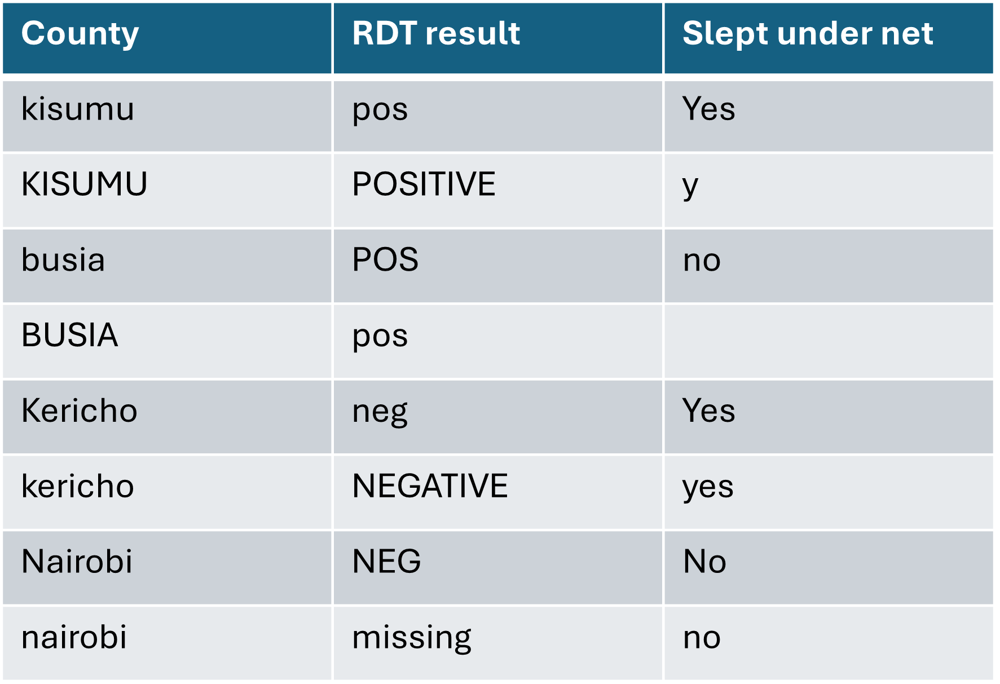
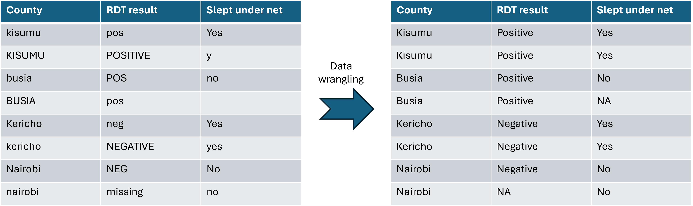
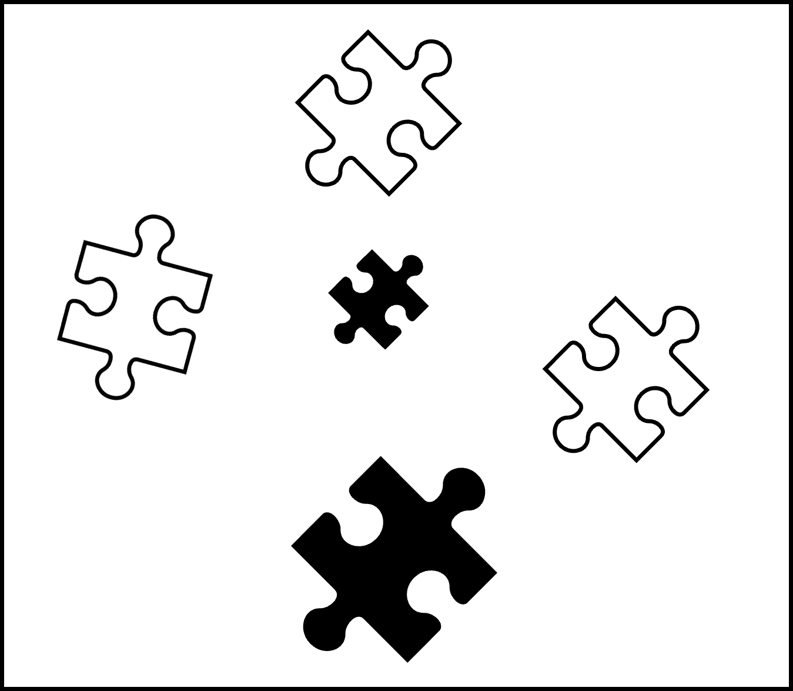
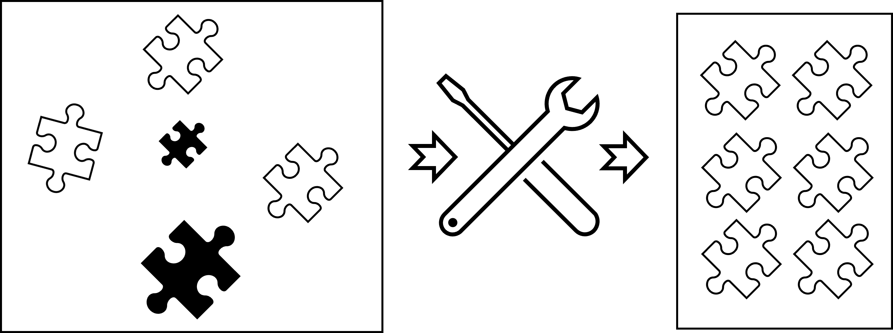
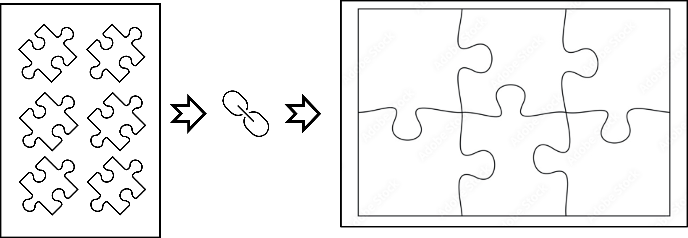

```{r}
#| label: setup
library(tidyverse)
theme_set(theme_minimal(base_size = 13))
```
------------------------------------------------------------------------
## Introduction {.unnumbered}

As the volume and complexity of data grow, having high-quality, well-structured datasets becomes essential for trustworthy insights and sound decisions. When data are disorganised or flawed, they can quietly distort results and waste precious time, money, and effort for people working on the front lines.

For epidemiologists, programme managers, clinicians, and analysts, this is a familiar burden: long hours spent hunting through Excel files, reconciling conflicting case definitions, or re-checking numbers that do not quite add up before a briefing or report.

This is where **data wrangling** comes in — the practical work of cleaning, structuring, and transforming raw data so they are ready for analysis and interpretation.

Real-world datasets are rarely ready for analysis. They are often:

-   spread across multiple files,
-   inconsistent in variable names and coding,
-   affected by missing values,
-   and full of choices that must be made before analysis can begin.

------------------------------------------------------------------------

### Warm-up and motivation {.unnumbered}

-   Quick interactive poll:
    -   How often do you receive data that are ready to analyse without any cleaning?
    -   What are the messiest data problems you have personally encountered?
    -   What is the most time-consuming data issue you face?

### Messy vs tidy {.unnumbered}

#### What’s wrong here? {.unnumbered}

{fig-align="center" width="100%"}

-   What issues do you notice?
-   Why would this be hard to analyse?

#### What changed? {.unnumbered}

{fig-align="center" width="100%"}

-   What improvements were made?

------------------------------------------------------------------------
### What we will do in this session {.unnumbered}

In this session, we will work through a Kenya DHS 2022 malaria dataset and practise turning messy, fragmented data into a tidy, analysis-ready dataset. The skills we will learn here apply to many other messy, real-world datasets.

We will work through data wrangling as a sequence of five practical steps.\
At each step, you will make decisions about the data:

1.  **Discovery** – explore and understand the data and their problems.
2.  **Data cleaning** – fix obvious errors and standardise structure.
3.  **Data transformation** – join, reshape, and derive variables.
4.  **Data validation** – check that the cleaned data make sense.
5.  **Data publishing** – produce an analysis-ready dataset and simple outputs.

------------------------------------------------------------------------

### Learning outcomes {.unnumbered}
By the end of this session, participants should be able to:

-   Recognise common data-wrangling challenges in survey-style analytics (messy names, inconsistent types, missingness, outliers, and fragmented files);
-   Inspect, clean, and organise variables in R using the tidyverse, including renaming, recoding categories, and standardising missing values;
-   Detect and handle impossible or suspicious values in numeric and categorical variables;
-   Join and reshape multiple related datasets between wide and long formats to create tidy, analysis-ready tables;
-   Produce a simple analysis-ready dataset and basic summaries or plots, using malaria data as a worked example.

------------------------------------------------------------------------

## Step 1: Discovery – first look at the data {.unnumbered}

**Discovery** is the first look at the puzzle pieces — understanding what each dataset contains before we start wrangling them.

{fig-align="center" width="70%"}

Like these pieces, our datasets come in different shapes and forms.

Before we can combine them, we need to understand what each piece contains and how they might fit together.

In DHS- or MIS-style surveys, data are typically split across multiple linked files, each containing part of the information we need.

### a) Load datasets (bring in the puzzle pieces) {.unnumbered}

Here, we load three datasets from the KDHS 2022 malaria data:

-   a **household dataset** (demographics and living conditions)\
-   a **malaria testing dataset** (individual test results)\
-   a **cluster dataset** (geographic information)

```{r}
#| label: load-data
households_raw <- read_csv("data/households_raw.csv", show_col_types = FALSE)
malaria_tests_raw <- read_csv("data/malaria_tests_raw.csv", show_col_types = FALSE)
clusters_raw <- read_csv("data/clusters_raw.csv", show_col_types = FALSE)
```

**Check:** - How many rows and columns does each dataset have? - What does that suggest about the number of households, children tested, and clusters?

### b) Explore the datasets (Inspect the puzzle pieces) {.unnumbered}

Before combining the datasets, we take a closer look at each piece to understand its structure and contents. \> **Function spotlight: `glimpse()`**\
\> `glimpse(df)` provides a quick overview of a dataset, showing the number of rows and columns, variable names, data types, and a few example values.\
\> It is useful in the discovery step to quickly understand the structure of your data before cleaning or transforming it.

```{r}
#| label: first-look
glimpse(households_raw)
glimpse(malaria_tests_raw)
glimpse(clusters_raw)
```
**Check:**
-   What does one row represent in each dataset? Are these the same unit?
-   Which variable names look difficult to work with?
-   Which variables look like they should be categorical?
-   Which variables might contain missing values coded as text or numbers?
-   Which variables could be used to link the three datasets together?

------------------------------------------------------------------------

## Step 2: Data cleaning – names, types, missingness, outliers {.unnumbered}

In the **Discovery step**, we examined the puzzle pieces and identified inconsistencies and issues.

Before we can fit the pieces together, we need to fix them — by standardising names, correcting data types, and handling missing or incorrect values.

{fig-align="center" width="100%"}

Data cleaning ensures that each piece is consistent, reliable, and usable, so that the rest of the workflow does not break.

We will clean the data step by step, focusing on common issues that occur in real-world datasets.

> **Function spotlight: the pipe `|>`**\
> The pipe passes the output of one step into the next, so\
> `data |> f() |> g()` reads as “take `data`, then apply `f()`, then `g()`”.\
> This makes wrangling code read from top to bottom like a recipe.

### a) Clean variable names {.unnumbered}

Before we move into inspecting data types and deeper data cleaning steps, we first standardise variable names across all datasets.

This ensures that column names are consistent and easy to reference in all subsequent steps.

> **Function spotlight: `rename_with()`**\
> `rename_with()` transforms column names using a function applied to each name.\
> Here we chain simple string functions to create consistent, machine-friendly names.

```{r}
#| label: clean-names
households_1 <- households_raw |>
  rename_with(.fn = ~ .x |>
                str_to_lower() |>
                str_replace_all("[^a-z0-9]+", "_") |>
                str_replace_all("^_|_$", ""))

tests_1 <- malaria_tests_raw |>
  rename_with(.fn = ~ .x |>
                str_to_lower() |>
                str_replace_all("[^a-z0-9]+", "_") |>
                str_replace_all("^_|_$", ""))

clusters_1 <- clusters_raw |>
  rename_with(.fn = ~ .x |>
                str_to_lower() |>
                str_replace_all("[^a-z0-9]+", "_") |>
                str_replace_all("^_|_$", ""))

names(households_1)
names(tests_1)
names(clusters_1)
```
**What is happening here step by step?** For each dataset (e.g. households_raw), we apply the same set of steps:

-   Take the dataset
-   Apply `rename_with()` to modify all column names
-   For each column name (`.x`):
    -   convert to lowercase → `str_to_lower()`
    -   replace spaces and special characters with → `str_replace_all("[^a-z0-9]+", "_")`
    -   remove leading or trailing underscores → `str_replace_all("^_|_$", "")`
-   Save the cleaned dataset (e.g. `households_1`, `tests_1`, `clusters_1`)

**Check:** Are there any names that still look problematic after cleaning?

### b) Inspect data types {.unnumbered}

Now that variable names are consistent, we inspect how each variable is currently stored.

Data types determine how variables behave in analysis. For example:

-   numeric variables can be summarised and plotted on continuous scales
-   character variables often represent categories and may later be converted to factors

```{r}
#| label: inspect-types
households_1 |> glimpse()
tests_1 |> glimpse()
```

**Check:** - Which variables are stored as `<chr>`, and what do they actually represent in the real world? - If you were to plot or summarise these variables now, what problems might you encounter? - Which variables might need a different data type to behave correctly in analysis?

### c) Recode inconsistent text values {.unnumbered}

In the previous step, we saw that many categorical variables are stored as <chr> and contain inconsistent representations of the same categories (e.g. `"yes"`, `"YES"`, `"y"`)

Here, we standardise these values so that each category is represented consistently, and convert coded nonresponse values (e.g. `""`, `"99"`, `"DK"`) to `NA`.

> **Function spotlight: `mutate()`**\
> `mutate()` adds new variables or modifies existing ones.\
> We use `mutate()` to standardise text values and recode them into consistent categories.

```{r}
#| label: recode-categories
households_2 <- households_1 |>
  mutate(
    residence_type = str_trim(str_to_title(residence_type)),
    residence_type = na_if(residence_type, ""),
    wealth_group = na_if(wealth_group, ""),
    wealth_group = na_if(wealth_group, "DK"),
    has_electricity = str_trim(str_to_lower(has_electricity)),
    has_electricity = case_when(
      has_electricity %in% c("yes") ~ "Yes",
      has_electricity %in% c("no") ~ "No",
      has_electricity %in% c("") ~ NA_character_,
      TRUE ~ NA_character_
    ),
    caregiver_sex = str_to_lower(caregiver_sex),
    caregiver_sex = case_when(
      caregiver_sex %in% c("female") ~ "Female",
      caregiver_sex %in% c("male") ~ "Male",
      caregiver_sex %in% c("99", "") ~ NA_character_,
      TRUE ~ NA_character_
    )
  )

tests_2 <- tests_1 |>
  mutate(
    sex = str_to_lower(sex),
    sex = case_when(
      sex %in% c("f", "female") ~ "Female",
      sex %in% c("m", "male") ~ "Male",
      sex %in% c("99", "") ~ NA_character_,
      TRUE ~ NA_character_
    ),
    rdt_result = str_to_lower(rdt_result),
    rdt_result = case_when(
      rdt_result %in% c("positive", "pos") ~ "Positive",
      rdt_result %in% c("negative", "neg") ~ "Negative",
      rdt_result %in% c("", "missing") ~ NA_character_,
      TRUE ~ NA_character_
    ),
    microscopy_result = str_to_lower(microscopy_result),
    microscopy_result = case_when(
      microscopy_result == "positive" ~ "Positive",
      microscopy_result == "negative" ~ "Negative",
      microscopy_result %in% c("", "not done") ~ NA_character_,
      TRUE ~ NA_character_
    ),
    slept_under_net = str_to_lower(slept_under_net),
    slept_under_net = case_when(
      slept_under_net %in% c("yes", "y") ~ "Yes",
      slept_under_net %in% c("no", "n") ~ "No",
      slept_under_net %in% c("", "99") ~ NA_character_,
      TRUE ~ NA_character_
    ),
    fever_last_2weeks = str_to_lower(fever_last_2weeks),
    fever_last_2weeks = case_when(
      fever_last_2weeks == "yes" ~ "Yes",
      fever_last_2weeks == "no" ~ "No",
      TRUE ~ NA_character_
    )
  )
```

### d) Convert useful variables to factors {.unnumbered}

Now that categorical values have been standardised, we now convert relevant variables from `<chr>` to factors.

Factors are used in R to represent categorical variables and are especially important for plotting, grouping, and modelling. They also allow us to define an explicit order for categories (e.g. wealth quintiles).

```{r}
#| label: to-factors
households_3 <- households_2 |>
  mutate(
    region_name = factor(region_name),
    residence_type = factor(residence_type),
    wealth_group = factor(
      wealth_group,
      levels = c("Poorest", "Poorer", "Middle", "Richer", "Richest")
    ),
    has_electricity = factor(has_electricity),
    caregiver_sex = factor(caregiver_sex)
  )

tests_3 <- tests_2 |>
  mutate(
    sex = factor(sex),
    rdt_result = factor(rdt_result, levels = c("Negative", "Positive")),
    microscopy_result = factor(microscopy_result, levels = c("Negative", "Positive")),
    slept_under_net = factor(slept_under_net),
    fever_last_2weeks = factor(fever_last_2weeks)
  )

glimpse(households_3)
glimpse(tests_3)
```

**Check:** - Why is it important to convert categorical variables from `<chr>` to `<fct>`? - Why might it be important to explicitly set the order of some factors?

### e) Detect missing values and coded nonresponse {.unnumbered}

Even after recoding text variables, missing data may still be hidden in different forms.

In survey datasets, missingness is not always recorded as `NA`. It may also appear as:

-   blank entries
-   numeric codes such as `99`
-   text codes such as `"DK"` or `"not done"`

If these are not standardised, summaries and analyses can be misleading because some missing values will be counted as real observations.

```{r}
#| label: missing-summary
missing_summary <- function(df) {
  df |>
    summarise(across(
      everything(),
      ~ sum(is.na(.))
    )) |>
    pivot_longer(
      cols = everything(),
      names_to = "variable",
      values_to = "n_missing"
    ) |>
    arrange(desc(n_missing))
}

missing_summary(households_3)
missing_summary(tests_3)
```

```{r}
#| label: fix-coded-missing
households_4 <- households_3 |>
  mutate(
    caregiver_age = na_if(caregiver_age, 99)
  )

missing_summary(households_4)
```

**Check:** - Which variables have the highest number of missing values, and what might this indicate about the data? - What changed in the missing-value summary after recoding `caregiver_age = 99` to `NA`? - What does this change reveal about how missing data can be represented in survey datasets?

### f) Check outliers and suspicious values {.unnumbered}

After standardising missing values, we check whether the remaining numeric values are plausible.

Some values are clearly impossible (e.g. negative ages), while others may be possible but unlikely (e.g. extremely high values). Both can distort summaries and analyses if left unchecked.

We start by summarising the range of key numeric variables to identify potential issues.

```{r}
#| label: numeric-summary
households_4 |>
  summarise(
    min_age = min(caregiver_age, na.rm = TRUE),
    max_age = max(caregiver_age, na.rm = TRUE),
    min_hh_size = min(hh_size, na.rm = TRUE),
    max_hh_size = max(hh_size, na.rm = TRUE),
    min_nets = min(bednet_count, na.rm = TRUE),
    max_nets = max(bednet_count, na.rm = TRUE)
  )

tests_3 |>
  summarise(
    min_age_months = min(age_months, na.rm = TRUE),
    max_age_months = max(age_months, na.rm = TRUE),
    min_hb = min(hb_g_dl, na.rm = TRUE),
    max_hb = max(hb_g_dl, na.rm = TRUE)
  )
```

These summaries highlight values that may fall outside expected ranges and warrant closer inspection.

```{r}
#| label: flag-outliers
households_flags <- households_4 |>
  mutate(
    caregiver_age_flag = caregiver_age < 15 | caregiver_age > 90,
    hh_size_flag = hh_size < 1 | hh_size > 15,
    bednet_count_flag = bednet_count > hh_size + 5
  )

tests_flags <- tests_3 |>
  mutate(
    child_age_flag = age_months < 0 | age_months > 59,
    hb_flag = hb_g_dl < 4 | hb_g_dl > 20
  )

households_flags |>
  filter(caregiver_age_flag | hh_size_flag | bednet_count_flag)

tests_flags |>
  filter(child_age_flag | hb_flag)
```

These flags help us identify observations that warrant closer inspection because one or more values fall outside expected ranges.

```{r}
#| label: recode-outliers
households_5 <- households_flags |>
  mutate(
    caregiver_age = if_else(caregiver_age_flag, NA_real_, caregiver_age),
    hh_size = if_else(hh_size_flag, NA_real_, as.numeric(hh_size)),
    bednet_count = if_else(bednet_count_flag, NA_real_, as.numeric(bednet_count))
  ) |>
  select(-ends_with("_flag"))

tests_4 <- tests_flags |>
  mutate(
    age_months = if_else(child_age_flag, NA_real_, as.numeric(age_months)),
    hb_g_dl = if_else(hb_flag, NA_real_, hb_g_dl)
  ) |>
  select(-ends_with("_flag"))
```

Cleaning data is not about “fixing” values — it is about ensuring that only valid data are used in analysis.

```{r}
#| label: skewed-distributions
tests_4 |>
  ggplot(aes(x = rdt_result)) +
  geom_bar()

households_5 |>
  ggplot(aes(x = bednet_count)) +
  geom_histogram(binwidth = 1)
```

These plots provide a final visual check of the cleaned variables and help assess whether the distributions now appear reasonable. **Check:** - Which values in the data would you consider implausible, and what assumptions are you making when deciding this? - How do the thresholds used to flag values reflect domain knowledge or analytical judgement? - What would be the impact on summaries or plots if these values were left unchanged? - Why is it important to flag and inspect values before recoding them to NA, rather than removing them directly?

------------------------------------------------------------------------

## Step 3: Data transformation – join and reshape {.unnumbered}

Up to this point, we have been working with separate datasets — each containing part of the information we need.

However, real analysis is rarely done on isolated files. To answer meaningful questions, we need to bring these pieces together into a single, coherent dataset.

This step transforms cleaned but fragmented data into an analysis-ready structure by:

-   combining datasets,
-   creating variables aligned with our analytical questions,
-   and reshaping the data into forms suitable for summaries and visualisation.

{fig-align="center" width="100%"}

### a) Join fragmented datasets {.unnumbered}

In real-world analytics, one question often requires data from several sources:

-   household characteristics,
-   child malaria test outcomes,
-   cluster-level context.

> **Function spotlight: `left_join()`**\
> `left_join(x, y, by = "id")` keeps all rows from `x` and adds matching columns from `y`.\
> It is central when we bring together information from multiple files.

```{r}
#| label: check-keys
households_5 |>
  count(hh_id) |>
  summarise(
    n_households = n(),
    any_duplicate_hh_id = any(n > 1)
  )

clusters_1 |>
  count(cluster_id) |>
  summarise(
    n_clusters = n(),
    any_duplicate_cluster_id = any(n > 1)
  )
```

```{r}
#| label: join-household-tests
child_level <- tests_4 |>
  left_join(
    households_5,
    by = "hh_id"
  )

glimpse(child_level)
```

```{r}
#| label: join-clusters
child_level_full <- child_level |>
  left_join(
    clusters_1,
    by = c("cluster_id" = "cluster_id")
  )

glimpse(child_level_full)
```

```{r}
#| label: check-join-success
child_level_full |>
  summarise(
    missing_region = sum(is.na(region_name)),
    missing_cluster_zone = sum(is.na(endemic_zone)),
    n_rows = n()
  )
```

These checks ensure that the keys used for joining uniquely identify observations, which helps avoid unintended duplication during joins.

### b) Create analysis-ready variables {.unnumbered}

After joining datasets, we often need to define variables that are directly usable for analysis.

In many analyses, outcomes and exposures are represented as simple, standardised variables (e.g. binary indicators), which makes summaries, modelling, and interpretation more straightforward.

```{r}
#| label: create-analysis-vars
analysis_df <- child_level_full |>
  mutate(
    malaria_positive = case_when(
      rdt_result == "Positive" ~ 1,
      rdt_result == "Negative" ~ 0,
      TRUE ~ NA_real_
    ),
    net_use = case_when(
      slept_under_net == "Yes" ~ 1,
      slept_under_net == "No" ~ 0,
      TRUE ~ NA_real_
    ),
    fever_recent = case_when(
      fever_last_2weeks == "Yes" ~ 1,
      fever_last_2weeks == "No" ~ 0,
      TRUE ~ NA_real_
    ),
    anaemia = case_when(
      hb_g_dl < 11 ~ 1,
      hb_g_dl >= 11 ~ 0,
      TRUE ~ NA_real_
    )
  )

analysis_df |> glimpse()
```

These variables translate raw survey responses into standardised indicators that can be easily summarised and analysed.

### c) Produce simple summaries {.unnumbered}

Once analysis variables are defined, we can begin exploring patterns in the data.

A common first step is to compute descriptive summaries by relevant groups (e.g. region or wealth group) to compare outcomes and exposures.

> **Function spotlight: `group_by()` + `summarise()`**\
> `group_by()` defines groups, and `summarise()` calculates one-row-per-group summaries.\
> Together, they are the main tools for descriptive tables.

```{r}
#| label: simple-summaries
analysis_df |>
  group_by(region_name) |>
  summarise(
    n_children = n(),
    malaria_prev = mean(malaria_positive, na.rm = TRUE),
    net_use_rate = mean(net_use, na.rm = TRUE),
    anaemia_prev = mean(anaemia, na.rm = TRUE)
  ) |>
  arrange(desc(malaria_prev))
```

```{r}
#| label: summary-by-wealth
analysis_df |>
  group_by(wealth_group) |>
  summarise(
    n_children = n(),
    malaria_prev = mean(malaria_positive, na.rm = TRUE),
    net_use_rate = mean(net_use, na.rm = TRUE)
  )
```

### d) Reshape data for analysis and visualisation {.unnumbered}

The same information can be organised in different ways depending on the task.

For example, a table that is convenient for reporting may not be suitable for plotting. Reshaping allows us to move between these structures without changing the underlying data.

-   **Wide format** stores each variable in its own column and is useful for comparing indicators side by side in tables.
-   **Long format** stores values in a single column with an indicator variable, and is often more suitable for plotting with `ggplot2`.

> **Function spotlight: `pivot_longer()` and `pivot_wider()`**\
> `pivot_longer()` turns multiple columns into a pair of columns (`name`, `value`).\
> `pivot_wider()` spreads `name`–`value` pairs back into columns.\
> They are key for moving between analysis tables and plots.

```{r}
#| label: wide-summary
region_summary_wide <- analysis_df |>
  group_by(region_name) |>
  summarise(
    malaria_prev = mean(malaria_positive, na.rm = TRUE),
    net_use_rate = mean(net_use, na.rm = TRUE),
    anaemia_prev = mean(anaemia, na.rm = TRUE)
  )

region_summary_wide
```

```{r}
#| label: long-summary
region_summary_long <- region_summary_wide |>
  pivot_longer(
    cols = c(malaria_prev, net_use_rate, anaemia_prev),
    names_to = "indicator",
    values_to = "value"
  )

region_summary_long
```

```{r}
#| label: plot-long
region_summary_long |>
  ggplot(aes(x = region_name, y = value)) +
  geom_col() +
  facet_wrap(~ indicator, scales = "free_y") +
  labs(
    x = "Region",
    y = "Value",
    title = "Indicators by region"
  ) +
  theme(axis.text.x = element_text(angle = 45, hjust = 1))
```

```{r}
#| label: long-to-wide
region_summary_long |>
  pivot_wider(
    names_from = indicator,
    values_from = value
  )
```

**Check:** - Why is it necessary to combine datasets before analysis? What information would otherwise be missing? - How do the variables you created simplify analysis compared to the original data? - If you wanted to plot multiple indicators across regions, what limitation would you encounter with the current dataset structure? 

------------------------------------------------------------------------

## Step 4: Data validation – do the cleaned data make sense? {.unnumbered}

After cleaning, joining, and transforming the data, we need to confirm that the final dataset is consistent, complete, and ready for analysis.

Validation is not about fixing data — it is about checking that the data meet basic expectations before using them to produce results.

In practice, this means verifying:

-   that required variables are present,
-   that key identifiers are complete,
-   that variables have the expected types, -and that key outcomes are sufficiently observed.

```{r}
#| label: validate-columns
expected_cols_analysis <- c(
  "hh_id", "cluster_id", "region_name", "endemic_zone",
  "sex", "age_months", "rdt_result", "microscopy_result",
  "slept_under_net", "fever_last_2weeks", "hb_g_dl",
  "wealth_group", "hh_size", "bednet_count",
  "malaria_positive", "net_use"
)

missing_cols <- setdiff(expected_cols_analysis, names(analysis_df))

if (length(missing_cols) == 0) {
  message("Column check passed: all expected columns present.")
} else {
  warning("Missing columns: ", paste(missing_cols, collapse = ", "))
}
```

```{r}
#| label: validate-keys
analysis_df |>
  summarise(
    missing_hh_id = sum(is.na(hh_id)),
    missing_cluster_id = sum(is.na(cluster_id))
  )
```

```{r}
#| label: validate-types
analysis_df |>
  summarise(
    rdt_result_type = class(rdt_result),
    wealth_group_type = class(wealth_group),
    malaria_positive_type = class(malaria_positive),
    age_months_type = class(age_months)
  )
```

```{r}
#| label: validate-rows
analysis_df |>
  summarise(
    n_rows = n(),
    n_with_rdt = sum(!is.na(rdt_result)),
    n_malaria_positive = sum(!is.na(malaria_positive)),
    pct_outcome_complete = mean(!is.na(malaria_positive)) * 100
  )
```

These checks form a simple “quality contract” — if they fail, results should not be trusted without further investigation. **Check:** - What would be the consequence of missing key identifiers (e.g. hh_id, cluster_id) in this dataset? - Why is it important to verify variable types before analysis? What could go wrong if they are incorrect? - How would a low value of pct_outcome_complete affect your analysis and interpretation? 

------------------------------------------------------------------------

## Step 5: Data publishing – a compact, reproducible pipeline {.unnumbered}

This final step brings the earlier wrangling decisions together into a more compact and reusable workflow.

Instead of cleaning and transforming the data in many separate objects, we now express the same logic in a form that is easier to rerun, adapt, and share with others.

This is an important part of publishing data work: not only producing an analysis-ready dataset, but also writing code that makes the process transparent and reproducible.

```{r}
#| label: helper-clean-names
clean_names_simple <- function(df) {
  names(df) <- names(df) |>
    str_to_lower() |>
    str_replace_all("[^a-z0-9]+", "_") |>
    str_replace_all("^_|_$", "")
  df
}
```

> **From steps to function**\
> Earlier, we cleaned names step by step with `rename_with()`.\
> Now we wrap the same pattern into `clean_names_simple()` so we can reuse it on any new dataset with one line of code.

```{r}
#| label: compact-pipeline
households_clean <- households_raw |>
  clean_names_simple() |>
  mutate(
    residence_type = str_trim(str_to_title(residence_type)),
    residence_type = na_if(residence_type, ""),
    wealth_group = na_if(wealth_group, ""),
    wealth_group = na_if(wealth_group, "DK"),
    has_electricity = str_trim(str_to_lower(has_electricity)),
    has_electricity = case_when(
      has_electricity == "yes" ~ "Yes",
      has_electricity == "no" ~ "No",
      TRUE ~ NA_character_
    ),
    caregiver_sex = str_to_lower(caregiver_sex),
    caregiver_sex = case_when(
      caregiver_sex == "female" ~ "Female",
      caregiver_sex == "male" ~ "Male",
      TRUE ~ NA_character_
    ),
    caregiver_age = na_if(caregiver_age, 99),
    caregiver_age = if_else(caregiver_age < 15 | caregiver_age > 90, NA_real_, caregiver_age),
    hh_size = if_else(hh_size < 1 | hh_size > 15, NA_real_, as.numeric(hh_size)),
    bednet_count = if_else(bednet_count > hh_size + 5, NA_real_, as.numeric(bednet_count))
  )

tests_clean <- malaria_tests_raw |>
  clean_names_simple() |>
  mutate(
    sex = str_to_lower(sex),
    sex = case_when(
      sex %in% c("f", "female") ~ "Female",
      sex %in% c("m", "male") ~ "Male",
      TRUE ~ NA_character_
    ),
    rdt_result = str_to_lower(rdt_result),
    rdt_result = case_when(
      rdt_result %in% c("positive", "pos") ~ "Positive",
      rdt_result %in% c("negative", "neg") ~ "Negative",
      TRUE ~ NA_character_
    ),
    microscopy_result = str_to_lower(microscopy_result),
    microscopy_result = case_when(
      microscopy_result == "positive" ~ "Positive",
      microscopy_result == "negative" ~ "Negative",
      TRUE ~ NA_character_
    ),
    slept_under_net = str_to_lower(slept_under_net),
    slept_under_net = case_when(
      slept_under_net %in% c("yes", "y") ~ "Yes",
      slept_under_net %in% c("no", "n") ~ "No",
      TRUE ~ NA_character_
    ),
    fever_last_2weeks = str_to_lower(fever_last_2weeks),
    fever_last_2weeks = case_when(
      fever_last_2weeks == "yes" ~ "Yes",
      fever_last_2weeks == "no" ~ "No",
      TRUE ~ NA_character_
    ),
    age_months = if_else(age_months > 59, NA_real_, as.numeric(age_months)),
    hb_g_dl = if_else(hb_g_dl < 4 | hb_g_dl > 20, NA_real_, hb_g_dl)
  )

analysis_df_compact <- tests_clean |>
  left_join(households_clean, by = "hh_id") |>
  left_join(clusters_1, by = "cluster_id") |>
  mutate(
    malaria_positive = case_when(
      rdt_result == "Positive" ~ 1,
      rdt_result == "Negative" ~ 0,
      TRUE ~ NA_real_
    ),
    net_use = case_when(
      slept_under_net == "Yes" ~ 1,
      slept_under_net == "No" ~ 0,
      TRUE ~ NA_real_
    )
  )

analysis_df_compact |> glimpse()
```

**Check:** - Why is it useful to wrap repeated cleaning logic into a function such as clean_names_simple()? - What are the advantages of expressing the workflow as a compact pipeline rather than many disconnected steps? - What information would another analyst need in order to rerun and trust this pipeline? Publishing data work means producing not only a cleaned dataset, but also a workflow that can be inspected, rerun, and trusted. 

------------------------------------------------------------------------

## Wrap-up {.unnumbered}

In this hackathon session, we used a malaria survey dataset to move from messy, fragmented data to a structured, analysis-ready dataset.

Along the way, we made a series of decisions — about naming, coding, missing values, joins, and structure — that directly shape the quality and reliability of any analysis.

**Key takeaways** - real-world data are often fragmented and inconsistent; - data wrangling is a critical analytical step, not just a technical one; - cleaning names, types, missing values, and outliers improves analysis quality; - joining data correctly is essential when working with multiple sources; - reshaping data allows us to move flexibly between analysis and visualisation; - a reproducible pipeline makes our decisions transparent and easier to reuse. Good analysis depends not only on the methods we use, but on how well we prepare and understand the data. 

------------------------------------------------------------------------

## Optional challenge exercises {.unnumbered}

Apply the workflow you developed in this session to extend the analysis. Focus on how new variables, groupings, and checks can provide additional insight.

1.  Create a variable for bed net access per household member using `bednet_count / hh_size`.
2.  Calculate malaria prevalence by endemic zone instead of region. What differences do you observe?
3.  Compare malaria prevalence among children who did and did not sleep under a net. What might this suggest?
4.  Create a plot of mean haemoglobin by region. What patterns do you see?
5.  Write a function that checks for impossible values across selected numeric variables (e.g. negative ages, unrealistic Hb values).

These exercises are designed to reinforce the idea that data wrangling is an iterative process — new questions often require revisiting and extending earlier steps.
